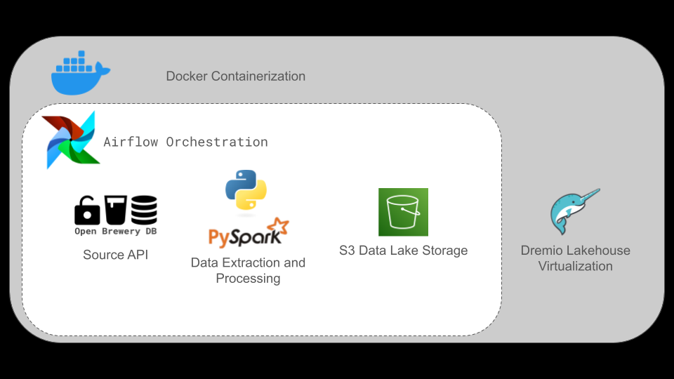

# Data Engineering Case for Ab-Inbev - BEES :beer: :honeybee:
The goal of this case is to extract data from the [Open Brewery DB ](https://www.openbrewerydb.org/) connecting to its API. We need to return a list of breweries with all its information and populate a Data Lake following the Medallion Architecture:
- Bronze Layer: Layer: The raw data from the API is persisted as a parquet file in a S3 bucket.
- Silver Layer: The data is transformed into a columnar storage format such as
parquet or delta, and partitioned by brewery location. 
- Gold Layer: The data is then aggregated  as a view with the quantity of breweries per type and location.

## Technologies involved: 

- Docker
- Airflow
- PySpark
- AWS S3
- Dremio

## Pipeline Architecture

This project runs AirFlow in a Docker container in order to orchestrate the OpenBreweryDB data pipeline. The DAG in Airflow extracts the data from the API and populate it into the layers. The data is persisted into S3 buckets as parquet files. A virtualization layer is created with Dremio which connects to S3 and formats the parquet files as tables. A view is created on top of the silver layer with SQL.



> :warning:  Note: the Dremio integration was not fully implemented, but the image was built in the Docker Container and and the instance was connected to my S3 bucket. I virtualized the bronze and silver layers formatting it as tables from the parquet files. I then proceeded to create a view on top of the silver layer table with Dremio's SQL engine and stored it as a view.

## Tutorial 

To run the contents in this project, first you need to clone the repo as follows:

git clone https://github.com/beatrizcm01/bees-data-engineering-case.git
cd bees-data-engineering-case

Then you need to have Docker Desktop installed. With Docker ready to go, navigate to the airflow-docker folder in this repo and initialize it:

```docker-compose up --build```

## Improvement Points


